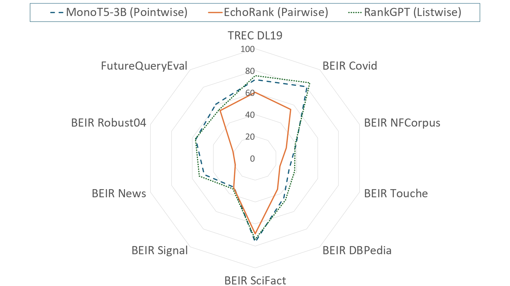

# How Good are LLM-based Rerankers? An Empirical Analysis of State-of-the-Art Reranking Models 🔍

<div align="center">
  <a href="https://arxiv.org/abs/XXXX.XXXXX">
    
  </a>
  <a href="https://github.com/DataScienceUIBK/llm-reranking-generalization-study">
    
  </a>
  <a href="#futurequery-dataset">
    
  </a>
  <a href="[https://huggingface.co/datasets/your-username/futurequery-eval](https://huggingface.co/datasets/abdoelsayed/FutureQueryEval)">
    
  </a>
</div>

<div align="center" style="font-family: Arial, sans-serif;">
  <p>
    <a href="#news" style="text-decoration: none; font-weight: bold;">🎉 News</a> •
    <a href="#introduction" style="text-decoration: none; font-weight: bold;">📖 Introduction</a> •
    <a href="#futurequery-dataset" style="text-decoration: none; font-weight: bold;">📄 FutureQueryEval Dataset</a>
  </p>
  <p>
    <a href="#quick-start" style="text-decoration: none; font-weight: bold;">🚀 Quick Start</a> •
    <a href="#evaluation-results" style="text-decoration: none; font-weight: bold;">📊 Results</a> •
    <a href="#citation" style="text-decoration: none; font-weight: bold;">🎈 Citation</a>
  </p>
</div>

# 🎉 News
- **[2025-08-22]** 🎯 **FutureQueryEval Dataset Released!** - The first temporal IR benchmark with queries from April 2025+
- **[2025-08-22]** 🔧 Comprehensive evaluation framework released - 22 reranking methods, 40 variants tested
- **[2025-08-22]** 📊 Integrated with <a href="https://arxiv.org/abs/2508.05512"> RankArena </a> leaderboard. You can view and interact with RankArena through this  <a href="https://rankarena.ngrok.io">link</a>
- **[2025-08-20]** 📝 Paper accepted at EMNLP Findings 2025

# 📖 Introduction

We present the **most comprehensive empirical study of reranking methods** to date, systematically evaluating 22 state-of-the-art approaches across 40 variants. Our key contribution is **FutureQueryEval** - the first temporal benchmark designed to test reranker generalization on truly novel queries unseen during LLM pretraining.

<div align="center">

<p><em>Performance comparison across pointwise, pairwise, and listwise reranking paradigms</em></p>
</div>

## Key Findings 🔍
- **Temporal Performance Gap**: 5-15% performance drop on novel queries compared to standard benchmarks
- **Listwise Superiority**: Best generalization to unseen content (8% avg. degradation vs 12-15% for others)
- **Efficiency Trade-offs**: Comprehensive runtime analysis reveals optimal speed-accuracy combinations
- **Domain Vulnerabilities**: All methods struggle with argumentative and informal content

# 📄 FutureQueryEval Dataset

## Overview
**FutureQueryEval** is a novel IR benchmark comprising **148 queries** with **2,938 query-document pairs** across **7 topical categories**, designed to evaluate reranker performance on temporal novelty.

### 🎯 Why FutureQueryEval?
- **Zero Contamination**: All queries refer to events after April 2025
- **Human Annotated**: 4 expert annotators with quality control
- **Diverse Domains**: Technology, Sports, Politics, Science, Health, Business, Entertainment
- **Real Events**: Based on actual news and developments, not synthetic data

### 📊 Dataset Statistics
| Metric | Value |
|--------|-------|
| Total Queries | 148 |
| Total Documents | 2,787 |
| Query-Document Pairs | 2,938 |
| Avg. Relevant Docs per Query | 6.54 |
| Languages | English |
| License | MIT |

### 🌍 Category Distribution
- **Technology**: 25.0% (37 queries)
- **Sports**: 20.9% (31 queries)  
- **Science & Environment**: 13.5% (20 queries)
- **Business & Finance**: 12.8% (19 queries)
- **Health & Medicine**: 10.8% (16 queries)
- **World News & Politics**: 9.5% (14 queries)
- **Entertainment & Culture**: 7.4% (11 queries)

### 📝 Example Queries
```
🌍 World News & Politics:
"What specific actions has Egypt taken to support injured Palestinians from Gaza, 
as highlighted during the visit of Presidents El-Sisi and Macron to Al-Arish General Hospital?"

⚽ Sports:
"Which teams qualified for the 2025 UEFA European Championship playoffs in June 2025?"

💻 Technology:
"What are the key features of Apple's new Vision Pro 2 announced at WWDC 2025?"
```

## Data Collection Methodology
1. **Source Selection**: Major news outlets, official sites, sports organizations
2. **Temporal Filtering**: Events after April 2025 only
3. **Query Creation**: Manual generation by domain experts
4. **Novelty Validation**: Tested against GPT-4 knowledge cutoff
5. **Quality Control**: Multi-annotator review with senior oversight

# 🚀 Quick Start
The code and Dataset will be available soon...

# 📊 Evaluation Results

## Top Performers on FutureQueryEval

| Method Category | Best Model | NDCG@10 | Runtime (s) |
|----------------|------------|---------|-------------|
| **Listwise** | Zephyr-7B | **62.65** | 1,240 |
| **Pointwise** | MonoT5-3B | **60.75** | 486 |
| **Setwise** | Flan-T5-XL | **56.57** | 892 |
| **Pairwise** | EchoRank-XL | **54.97** | 2,158 |
| **Tournament** | TourRank-GPT4o | **62.02** | 3,420 |

## Performance Insights
- 🏆 **Best Overall**: TourRank-GPT4o (62.02 NDCG@10)
- ⚡ **Best Efficiency**: FlashRank-MiniLM (55.43 NDCG@10, 195s)
- 🎯 **Best Balance**: MonoT5-3B (60.75 NDCG@10, 486s)

<div align="center">

<p><em>Runtime vs. Performance trade-offs across reranking methods</em></p>
</div>

# 🔧 Supported Methods

We evaluate **22 reranking approaches** across multiple paradigms:

### Pointwise Methods
- MonoT5, RankT5, InRanker, TWOLAR
- FlashRank, Transformer Rankers
- UPR, MonoBERT, ColBERT

### Listwise Methods  
- RankGPT, ListT5, Zephyr, Vicuna
- LiT5-Distill, InContext Rerankers

### Pairwise Methods
- PRP (Pairwise Ranking Prompting)
- EchoRank

### Advanced Methods
- Setwise (Flan-T5 variants)
- TourRank (Tournament-based)
- RankLLaMA (Task-specific fine-tuned)

# 🔄 Dataset Updates

**FutureQueryEval will be updated every 6 months** with new queries about recent events to maintain temporal novelty. Subscribe to releases for notifications!

## Upcoming Updates
- **Version 1.1** (December 2025): +100 queries from July-September 2025 events
- **Version 1.2** (June 2026): +100 queries from October 2025-March 2026 events


# 📋 Leaderboard

Submit your reranking method results to appear on our leaderboard! See [SUBMISSION.md](SUBMISSION.md) for guidelines.

Current standings available at: [RanArena](https://rankarena.ngrok.io) 

# 🤝 Contributing

We welcome contributions! See [CONTRIBUTING.md](CONTRIBUTING.md) for:
- Adding new reranking methods
- Improving evaluation metrics  
- Dataset quality improvements
- Bug fixes and optimizations


# 🎈 Citation

If you use FutureQueryEval or our evaluation framework, please cite:

```bibtex
Coming Soon  

```

# 📞 Contact

- **Authors**: [Abdelrahman Abdallah](mailto:abdelrahman.abdallah@uibk.ac.at), [Bhawna Piryani](mailto:bhawna.piryani@uibk.ac.at)
- **Institution**: University of Innsbruck
- **Issues**: Please use GitHub Issues for bug reports and feature requests

---

<div align="center">
<p>⭐ Star this repo if you find it helpful! ⭐</p>
<p>📧 Questions? Open an issue or contact the authors</p>
</div>
